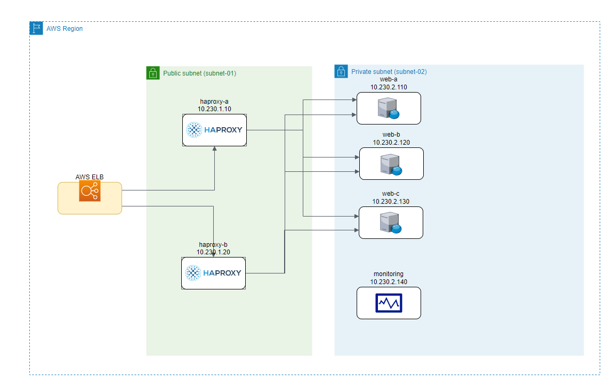

# aws-terraform-haproxy-stack

Deploy Haproxy configuration in AWS cloud using Terraform

## Progress

- [X] draw.io diagram
- [ ] main terraform deployment
- [X] network terraform module
- [X] haproxy terraform module
- [X] web terraform module
- [ ] monitoring terraform module (Grafana | Loki) - Docker Compose?
- [ ] Haproxy SPOE + Coraza WAF SPOA
- [ ] Diagram as Code
- [ ] Deployment scripts (AWS Deploy | Github Actions | Jenkins)
- [ ] traffic generator terraform module
- [ ] TF security (BridgeCrew | Snyk)
- [ ] OpenTofu - deployment GH Actions

## Network Diagram



## Github Actions deployment

Terraform Cloud:

- add token and save as TF_API_TOKEN

## Pre-requisites

Existing SSH Key pair "aws_keypair" - e.g.:

```console
aws --region=eu-west-1 create-key-pai --key-name aws_keypair --query 'KeyMaterial' --output text > aws_keypair.pem
```
